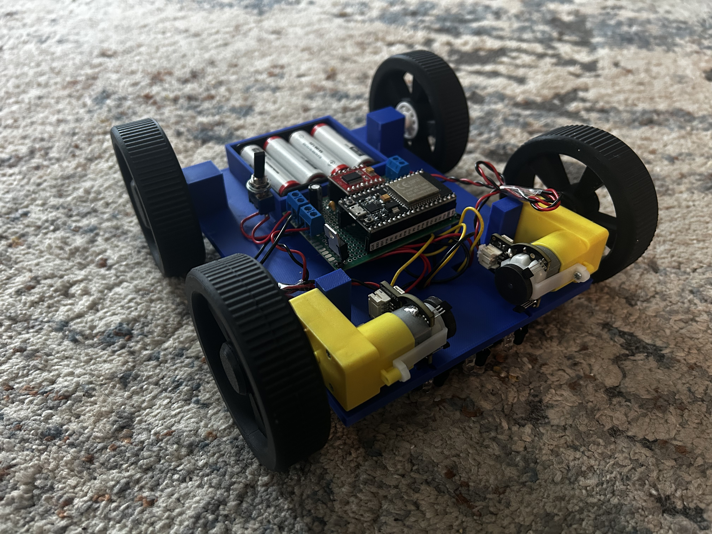
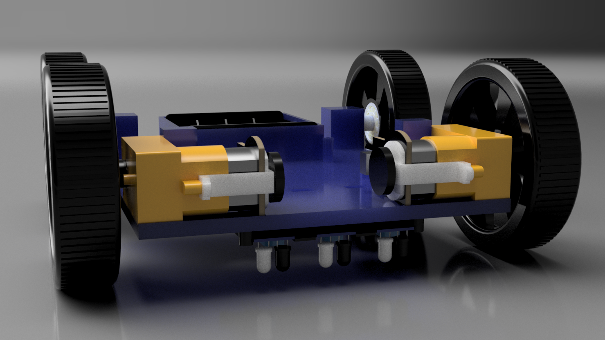
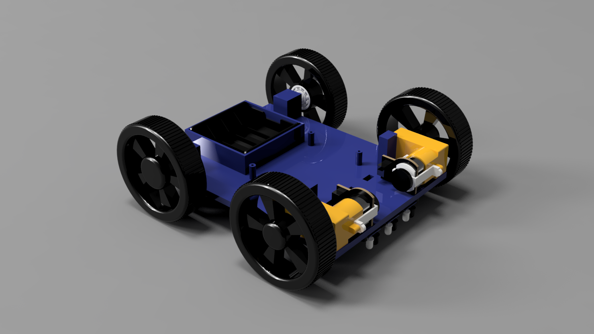
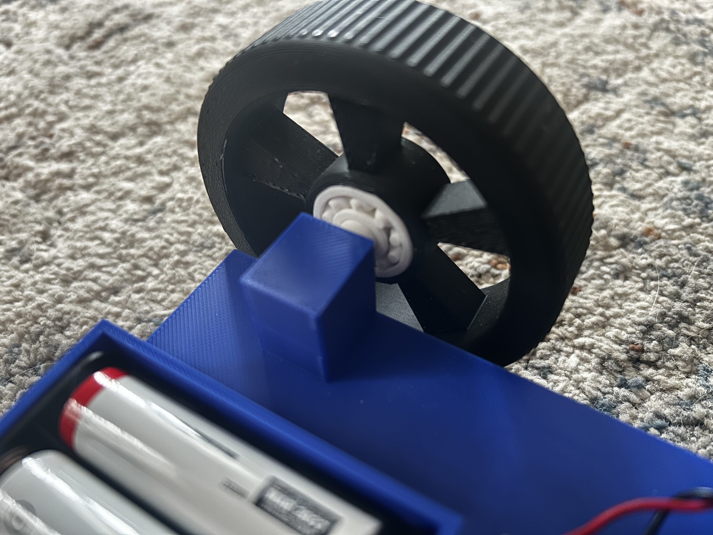
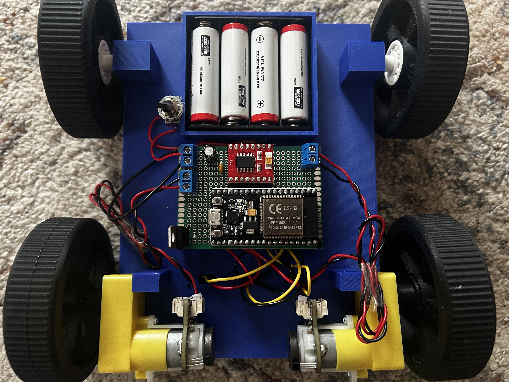
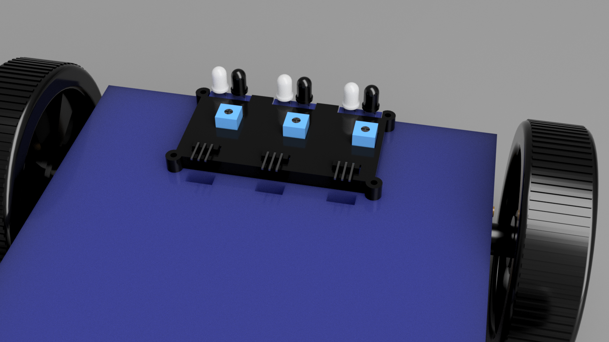
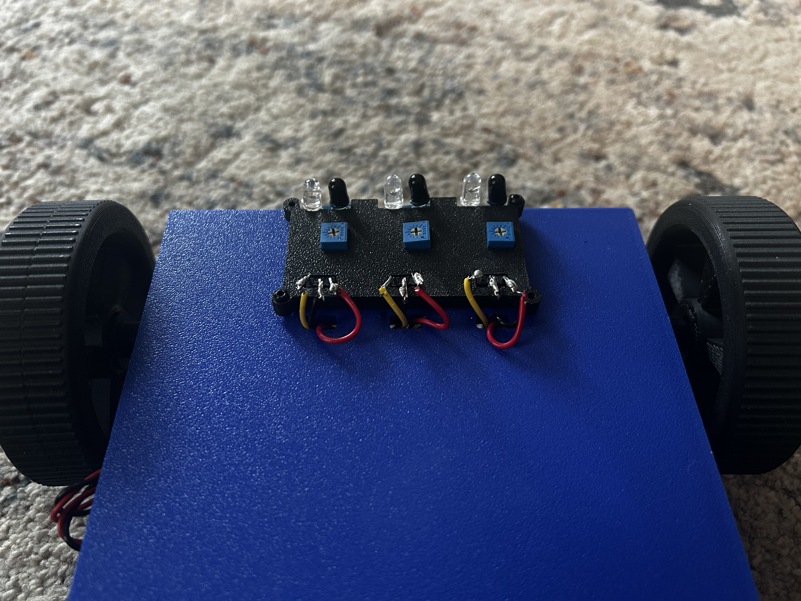

# 3D-Printed Line Following Robot

This project is an autonomous line-following robot built around an ESP32, featuring a fully custom-designed and 3D-printed chassis.

The goal of this project was to design, build, and validate a complete embedded system from scratch, integrating mechanical design, electronics, and control logic into a working robotic platform.

## Features 
- 3-sensor line detection system using IR reflectance sensors
- Differential drive control using TB6612FNG motor driver
- Custom 3D-printed chassis designed in Fusion 360
- Real-time line-following logic with recovery/search behavior
- Modular circuit design using perfboard and KiCad schematic planning
- Power stabilization using decoupling capacitors

## Hardware 
- ESP32 dev board
- TB6612FNG dual Motor driver 
- 2 DC motors
- 3 line sensors (IR reflectance sensors)
- 4 AA battery holder + batteries
- 5V regulator
- Capacitors (100µF electrolytic, 0.1µF ceramic)
- Power switch

## Mechanical Design

- Fully custom chassis designed in Fusion 360
- Integrated mounts for:
    - Motors
    - Perfboard electronics
    - Battery holder
- Dedicated IR sensor mounting system:
    - Secure placement under chassis
    - Adjustable access to tuning potentiometers
- Wire routing channels built into chassis for cleaner assembly
- Tested multiple wheel and bearing configurations for stability

## CAD
The /cad directory includes:
- Fusion 360 source files (.f3d)
- Printable models (.3mf)

Custom-designed components:
- Chassis
- Sensor mount
- Front and rear wheels
- Hubcaps

Standard components (motors, sensors, battery holder) were modeled for fit and used in render but are not included.

*Overall CAD render of the robot chassis.*

*Close-up of rear wheel and bearing integration.*

## Electronics 

- Custom schematic designed in KiCad with simplified component models
- Use of net labels to improve schematic clarity and organization
- Perfboard implementation for final circuit assembly
- Key design considerations:
    - Shared ground between battery, ESP32, and motor driver
    - 5V regulation for logic components and ESP32
    - Decoupling (0.1µF) + bulk capacitance (100µF) for power stability

### Sensor Array
The robot uses a 3-sensor IR reflectance array mounted beneath the chassis for line detection. 
The custom mount provides stable positioning while maintaining access to sensor tuning potentiometers.

### Schematic

*KiCad schematic used for circuit planning and perfboard implementation.*

## Control System
- Sensor readings processed in real time via ESP32
- Line-following logic based on prioritized sensor states
- Implemented fallback search behavior with a 1s timeout when line is lost

## Development Process
This project was developed iteratively, with hardware and software tested in stages:
- Prototyped and validated motors and driver independently
- Calibrated IR sensors using Serial Monitor feedback
- Designed and refined CAD components before full assembly
- Built and verified circuit incrementally on perfboard
- Integrated full system and performed real-world testing

## Challenges & Lessons Learned
- Power instability:
    - Experienced brownouts at startup due to voltage sag from motors
    - Highlighted importance of power distribution and decoupling
- Sensor calibration:
    - Required careful tuning to ensure consistent detection range
- Wiring complexity:
    - Reinforced importance of planning layout before soldering
- Schematic design:
    - Learned how net labels simplify complex circuits significantly
- CAD:
    - Iterated through multiple wheel and chassis designs to ensure proper fit and alignment
    - Designed mounting features to simplify assembly and reduce wire clutter

## Future Improvements 
- Implement PID control for smoother and faster line tracking
- Improve power delivery (separate motor supply or better regulation)
- Upgrade power supply from alkaline AA batteries to a higher-current rechargeable battery pack
- Design a custom PCB
- Add Bluetooth / remote control for selecting different behaviour modes
- Improve wire organization for maintainability and debugging 

## Credits 
- Rear wheel bearing model: https://www.printables.com/model/583731-print-in-place-ball-bearings